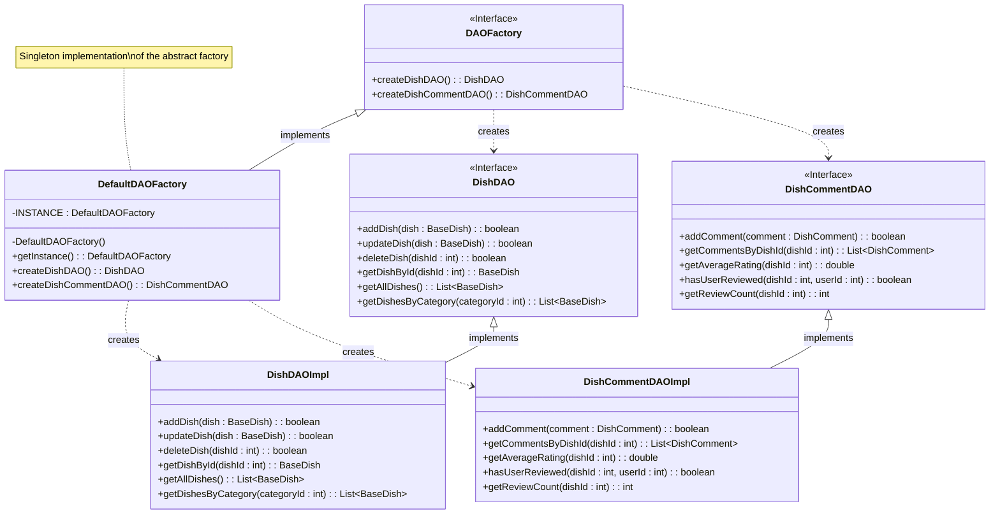

# Abstract Factory Pattern UML Class Diagram

## Class Diagram

## Key Characteristics

1. **Abstract Factory (DAOFactory)**: Declares an interface for operations that create abstract product objects (DishDAO, DishCommentDAO).

2. **Concrete Factory (DefaultDAOFactory)**: Implements the operations to create concrete product instances (DishDAOImpl, DishCommentDAOImpl).

3. **Abstract Product (DishDAO, DishCommentDAO)**: Declares an interface for a type of product object.

4. **Concrete Product (DishDAOImpl, DishCommentDAOImpl)**: Defines a product object to be created by the corresponding concrete factory and implements the Abstract Product interface.

## Participants

- **AbstractFactory (DAOFactory)**: Declares a method for creating each of the abstract products.
- **ConcreteFactory (DefaultDAOFactory)**: Implements the operations to create concrete product objects.
- **AbstractProduct (DishDAO, DishCommentDAO)**: Declares an interface for a type of product object.
- **ConcreteProduct (DishDAOImpl, DishCommentDAOImpl)**: Defines a product object to be created by the corresponding concrete factory and implements the AbstractProduct interface.

## Collaborations

- Normally a single instance of a ConcreteFactory class is created at runtime, and this concrete factory creates all the different product objects for a specific product family.
- The client uses only interfaces declared by AbstractFactory and AbstractProduct classes.