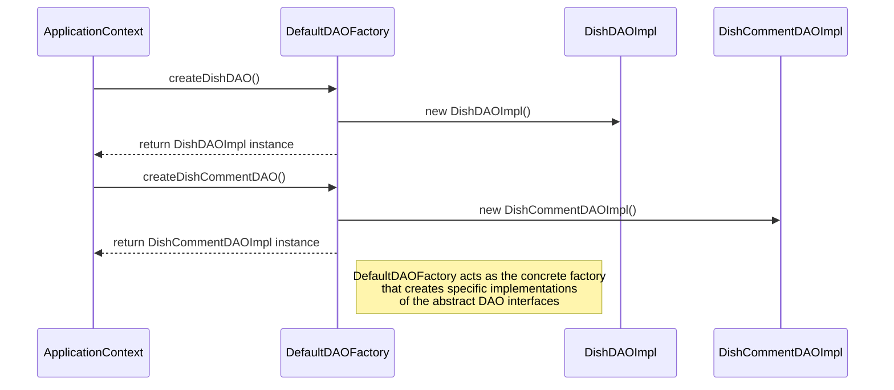

# Abstract Factory Pattern Sequence Diagram

## Sequence Diagram

## Key Steps in Abstract Factory Usage

1. **Factory Request**: ApplicationContext requests creation of specific DAO objects from the DefaultDAOFactory.
2. **Product Creation**: DefaultDAOFactory creates concrete implementations of the abstract DAO interfaces.
3. **Return Instances**: The factory returns the created instances to the ApplicationContext.

## Benefits Demonstrated

- **Encapsulation of Object Creation**: The client (ApplicationContext) doesn't need to know the specific classes being instantiated.
- **Consistency**: The factory ensures that related objects (DishDAOImpl and DishCommentDAOImpl) are used together.
- **Flexibility**: The system could easily switch to a different factory implementation without changing client code.