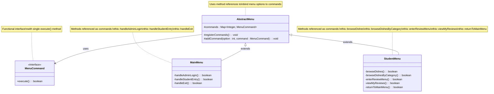

# Command Pattern UML Class Diagram

## Class Diagram



## Key Characteristics

1. **Command (MenuCommand)**: Declares an interface for executing an operation with the `execute()` method that returns a boolean indicating whether the menu should exit.

2. **ConcreteCommand**: Not explicitly defined as separate classes. Instead, the pattern uses method references (e.g., `this::handleAdminLogin`) which act as concrete commands.

3. **Invoker (AbstractMenu)**: Asks the command to carry out the request. The `AbstractMenu` class stores commands in a map and invokes them based on user input.

4. **Receiver**: The receiver is the menu class itself (MainMenu, StudentMenu, etc.) which contains the actual implementation of the operations.

## Participants

- **Command (MenuCommand)**: Declares an interface for executing an operation.
- **ConcreteCommand**: Method references in the menu classes that implement the MenuCommand interface.
- **Invoker (AbstractMenu)**: Asks the command to carry out the request by calling its execute() method.
- **Receiver**: The concrete menu classes (MainMenu, StudentMenu) that contain the actual implementation of operations.

## How It Works

1. Each concrete menu class (MainMenu, StudentMenu) registers commands in their `registerCommands()` method using method references.
2. The `addCommand()` method in AbstractMenu associates menu option numbers with specific command implementations.
3. When a user selects a menu option, the AbstractMenu invokes the corresponding command's `execute()` method.
4. The method reference executes the appropriate method in the receiver (the menu class itself).

## Example Usage in MainMenu

```java
@Override
protected void registerCommands() {
    addCommand(1, this::handleAdminLogin);  // Command for option 1
    addCommand(2, this::handleStudentEntry); // Command for option 2
    addCommand(3, this::handleExit);        // Command for option 3
}
```

In this example:
- `this::handleAdminLogin` is a method reference that implements the MenuCommand interface
- When option 1 is selected, `handleAdminLogin()` is executed
- The method returns a boolean indicating whether the menu should exit