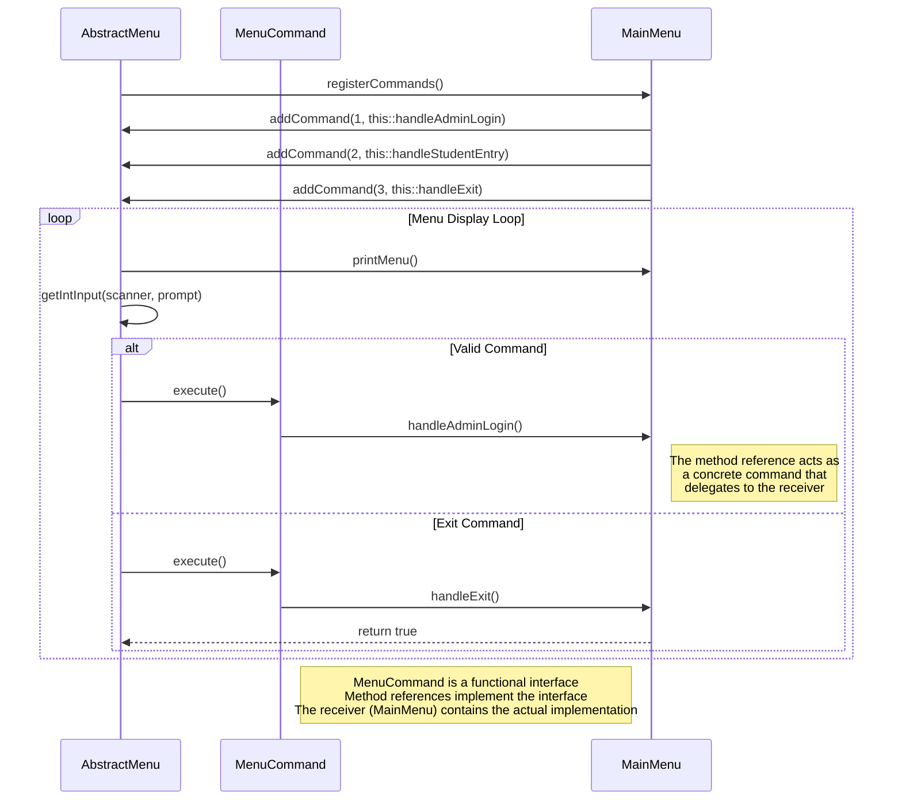

# Command Pattern Sequence Diagram

## Sequence Diagram

## Key Steps in Command Pattern Usage

1. **Command Registration**: During menu initialization, the concrete menu registers commands by associating menu options with method references.
2. **User Selection**: When a user selects a menu option, the AbstractMenu retrieves the corresponding command.
3. **Command Execution**: The AbstractMenu calls the command's `execute()` method.
4. **Method Invocation**: The method reference invokes the appropriate method in the receiver (MainMenu).

## Benefits Demonstrated

- **Decoupling**: AbstractMenu doesn't need to know the specific methods being executed.
- **Flexibility**: New commands can be added by simply registering new method references.
- **Parametrization**: Menu options are parametrized with different command implementations.
- **Extensibility**: Additional menu options can be added without modifying the AbstractMenu class.