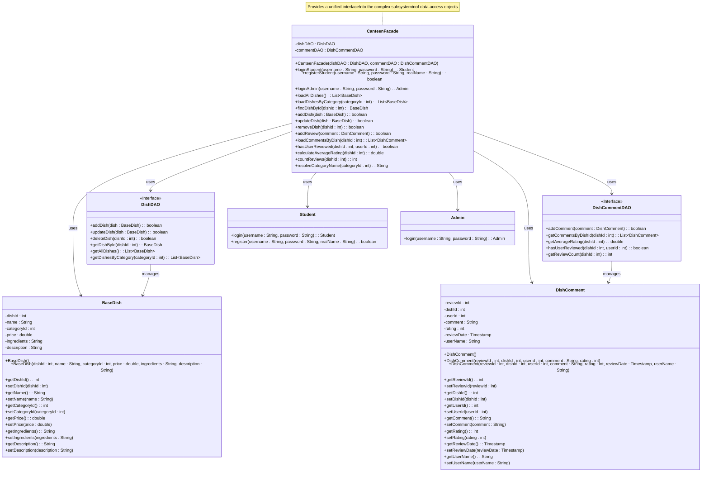

# Facade Pattern UML Class Diagram

## Class Diagram

## Key Characteristics

1. **Facade (CanteenFacade)**: Knows which subsystem classes are responsible for what and delegates client requests to appropriate subsystem objects.

2. **Subsystem Classes (DishDAO, DishCommentDAO, BaseDish, DishComment, Student, Admin)**: Implement subsystem functionality and handle work assigned by the Facade object. They don't know about the facade and don't keep references to it.

## Participants

- **Facade (CanteenFacade)**: Knows which subsystem classes are responsible for what and delegates client requests to appropriate subsystem objects.
- **Subsystem Classes (DishDAO, DishCommentDAO, BaseDish, DishComment, Student, Admin)**: Implement subsystem functionality and handle work assigned by the Facade object.

## Collaborations

- Clients communicate with the subsystem by working through a Facade instance.
- The facade forwards client requests to appropriate subsystem objects.
- Subsystem classes don't know about the facade and don't keep references to it.