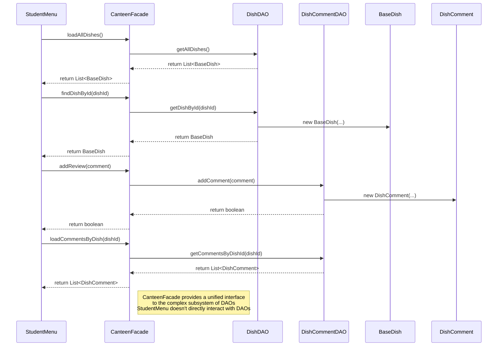

# Facade Pattern Sequence Diagram

## Sequence Diagram

## Key Steps in Facade Usage

1. **Client Request**: StudentMenu requests operations through the CanteenFacade.
2. **Facade Delegation**: CanteenFacade delegates the requests to appropriate subsystem components (DAOs).
3. **Subsystem Processing**: The DAOs perform the actual data operations.
4. **Result Return**: Results are passed back through the facade to the client.

## Benefits Demonstrated

- **Simplified Interface**: StudentMenu interacts with a single interface rather than multiple DAOs.
- **Decoupling**: StudentMenu is decoupled from the subsystem implementation details.
- **Ease of Use**: Complex operations are simplified through the facade methods.