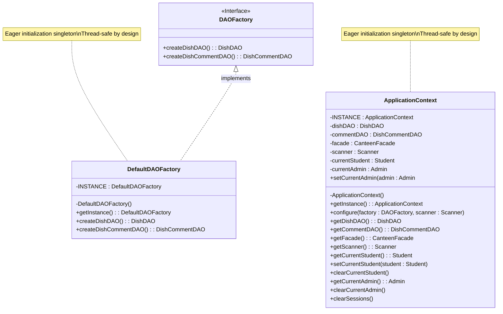

# Singleton Pattern UML Class Diagram

## Class Diagram

## Key Characteristics

1. **Private Constructor**: Both `ApplicationContext` and `DefaultDAOFactory` have private constructors to prevent external instantiation.

2. **Static Instance**: Each class has a private static final instance member that holds the single instance.

3. **Public Access Method**: Both classes provide a static `getInstance()` method to access the singleton instance.

4. **Thread Safety**: Uses eager initialization (instantiation at class loading time) which is inherently thread-safe.

## Participants

- **Singleton (ApplicationContext, DefaultDAOFactory)**: Defines an Instance operation that lets clients access its unique instance. May be responsible for creating its own unique instance.

## Collaborations

- `ApplicationContext` collaborates with `DAOFactory` to initialize the DAO objects and `CanteenFacade`.
- `DefaultDAOFactory` implements the `DAOFactory` interface to create concrete DAO instances.
