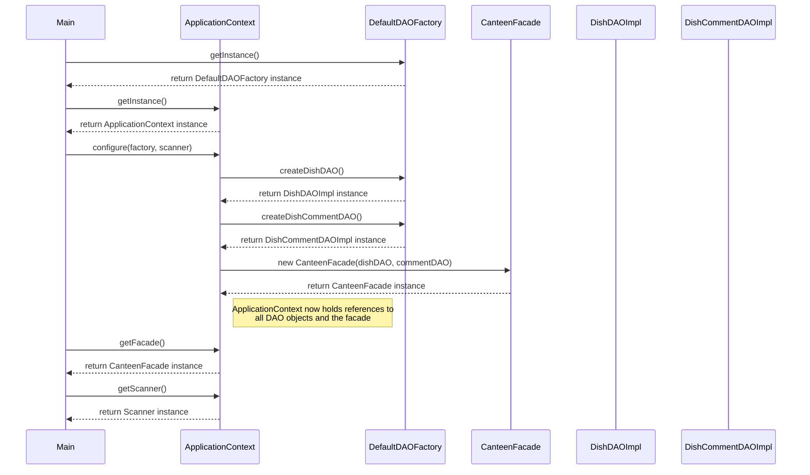

# Singleton Pattern Sequence Diagram

## Sequence Diagram

## Key Steps in Singleton Usage

1. **Obtaining Factory Instance**: Main class requests the singleton instance of DefaultDAOFactory using `getInstance()`.
2. **Obtaining Context Instance**: Main class requests the singleton instance of ApplicationContext using `getInstance()`.
3. **Configuration**: Main class configures the ApplicationContext with the factory and scanner.
4. **DAO Creation**: ApplicationContext uses the factory to create concrete DAO instances.
5. **Facade Creation**: ApplicationContext creates the CanteenFacade with the DAO instances.
6. **Accessing Components**: Other classes can access the shared components through the singleton ApplicationContext.

## Benefits Demonstrated

- **Global Access**: Any part of the application can access the singleton instances.
- **Controlled Instantiation**: Only one instance of each singleton class exists.
- **Resource Sharing**: The ApplicationContext serves as a central repository for shared resources.