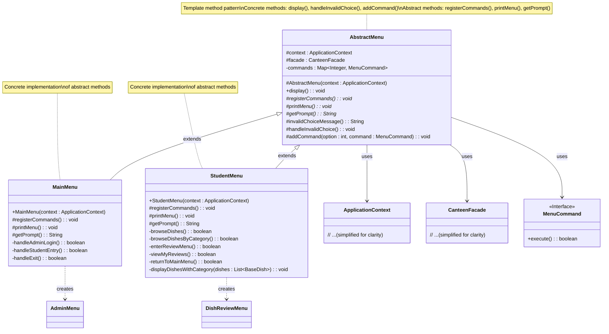

# Template Method Pattern UML Class Diagram

## Class Diagram

## Key Characteristics

1. **Abstract Class (AbstractMenu)**: Defines abstract primitive operations (`registerCommands()`, `printMenu()`, `getPrompt()`) that concrete subclasses implement to define the steps of the algorithm. Implements a template method (`display()`) that defines the skeleton of an algorithm.

2. **Concrete Classes (MainMenu, StudentMenu)**: Each implements all abstract operations of the abstract class to carry out subclass-specific steps of the algorithm.

## Participants

- **AbstractClass (AbstractMenu)**: Defines abstract primitive operations that concrete subclasses define to implement steps of an algorithm, and implements a template method that defines the skeleton of an algorithm.
- **ConcreteClass (MainMenu, StudentMenu)**: Implements the abstract primitive operations to carry out subclass-specific steps of the algorithm.

## Template Method

The `display()` method in `AbstractMenu` is the template method that defines the basic structure of menu processing:
1. Print menu options (`printMenu()`)
2. Get user input (`getPrompt()`)
3. Execute command based on input
4. Handle invalid choices (`handleInvalidChoice()`)

The template method itself is not overridden by subclasses, but it calls abstract methods that are overridden.

## Hook Methods

- `invalidChoiceMessage()`: A hook method that provides a default implementation but can be overridden by subclasses if needed.
- `handleInvalidChoice()`: Another hook method that provides default behavior for handling invalid user input.

## Collaborations

- Concrete classes implement the abstract operations called by the template method to define the specific steps of the algorithm for their use case.
- The template method controls when the abstract operations and hook methods are called.