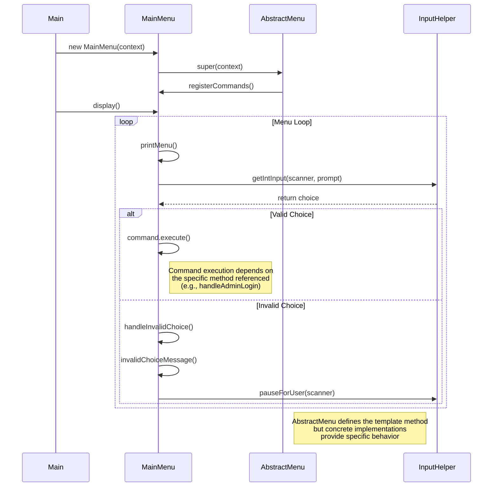

# Template Method Pattern Sequence Diagram

## Sequence Diagram

## Key Steps in Template Method Usage

1. **Instantiation**: Main creates a concrete menu instance (MainMenu).
2. **Initialization**: During construction, the abstract menu's constructor calls the concrete class's `registerCommands()` method.
3. **Display Loop**: The `display()` template method runs a loop that:
   - Calls the concrete class's `printMenu()` method
   - Gets user input using InputHelper
   - Executes the appropriate command or handles invalid input
4. **Command Execution**: When a valid command is executed, it runs the specific method referenced in the concrete class.

## Benefits Demonstrated

- **Code Reuse**: The menu display logic is defined once in the abstract class.
- **Extensibility**: New menu types can be created by extending AbstractMenu and implementing the abstract methods.
- **Inversion of Control**: The abstract class controls the overall flow, calling methods in the concrete class at appropriate times.