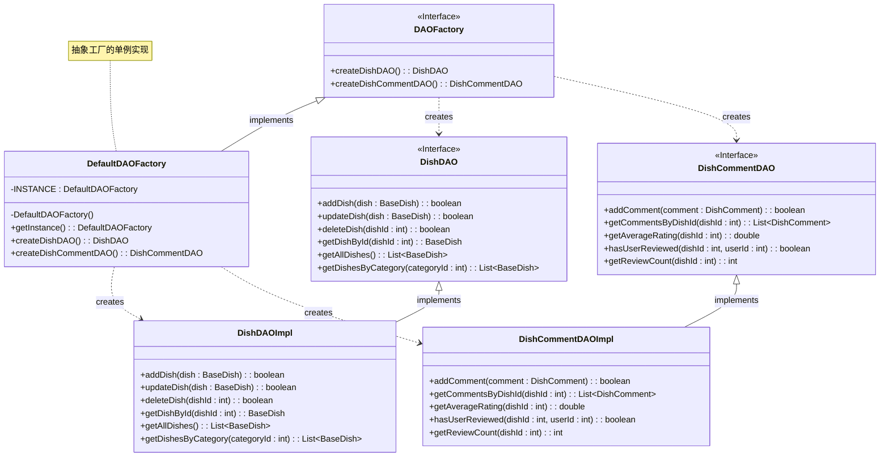

# 抽象工厂模式 UML 类图

## 类图

## 主要特点

1. **抽象工厂 (DAOFactory)**: 声明用于创建抽象产品对象的操作接口 (DishDAO, DishCommentDAO)。

2. **具体工厂 (DefaultDAOFactory)**: 实现操作以创建具体的产品实例 (DishDAOImpl, DishCommentDAOImpl)。

3. **抽象产品 (DishDAO, DishCommentDAO)**: 声明一种产品对象的接口。

4. **具体产品 (DishDAOImpl, DishCommentDAOImpl)**: 定义由相应具体工厂创建的产品对象，并实现抽象产品接口。

## 参与者

- **抽象工厂 (DAOFactory)**: 声明创建每种抽象产品的方法。
- **具体工厂 (DefaultDAOFactory)**: 实现操作以创建具体的产品对象。
- **抽象产品 (DishDAO, DishCommentDAO)**: 声明一种产品对象的接口。
- **具体产品 (DishDAOImpl, DishCommentDAOImpl)**: 定义由相应具体工厂创建的产品对象，并实现抽象产品接口。

## 协作关系

- 通常在运行时创建一个具体工厂类的单个实例，该具体工厂为特定产品族创建所有不同的产品对象。
- 客户端仅使用抽象工厂和抽象产品类声明的接口。