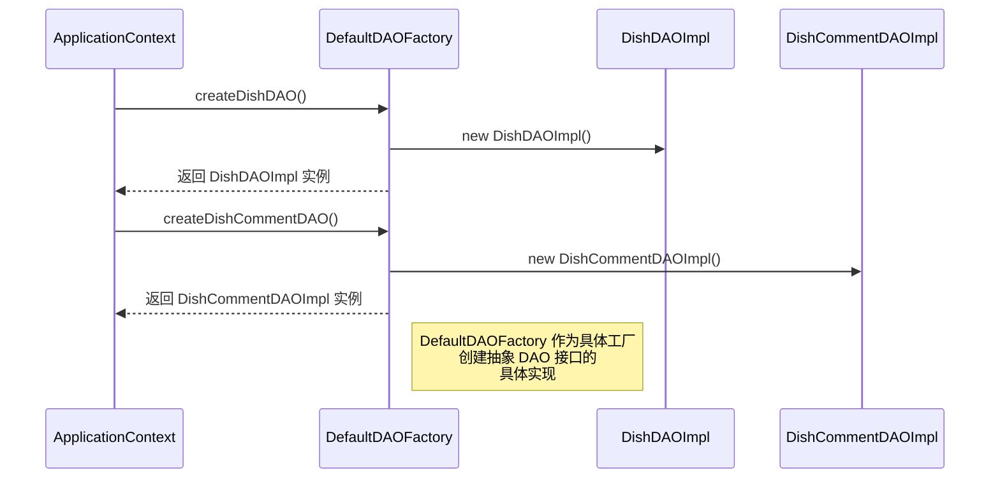

# 抽象工厂模式 时序图

## 时序图

## 抽象工厂使用的關鍵步骤

1. **工厂请求**: ApplicationContext 从 DefaultDAOFactory 请求创建特定的 DAO 对象。
2. **产品创建**: DefaultDAOFactory 创建抽象 DAO 接口的具体实现。
3. **返回实例**: 工厂将创建的实例返回给 ApplicationContext。

## 展示的优势

- **对象创建的封装**: 客户端 (ApplicationContext) 不需要知道正在实例化的具体类。
- **一致性**: 工厂确保相关对象 (DishDAOImpl 和 DishCommentDAOImpl) 一起使用。
- **灵活性**: 系统可以轻松切换到不同的工厂实现，而无需更改客户端代码。