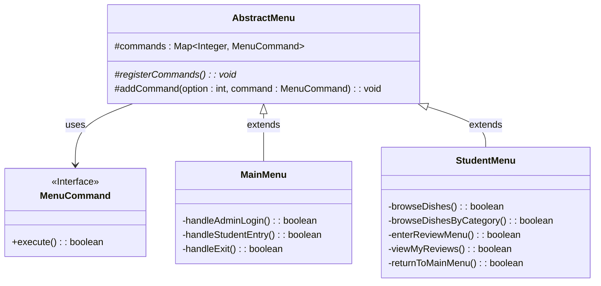

# 命令模式 UML 类图

## 类图



## 主要特点

1. **命令 (MenuCommand)**: 声明执行操作的接口，`execute()` 方法返回布尔值，指示菜单是否应退出。

2. **具体命令**: 未明确定义为单独的类。相反，该模式使用方法引用（例如 `this::handleAdminLogin`）作为具体命令。

3. **调用者 (AbstractMenu)**: 请求命令执行请求。`AbstractMenu` 类将命令存储在映射中，并根据用户输入调用它们。

4. **接收者**: 接收者是菜单类本身（MainMenu, StudentMenu 等），其中包含操作的实际实现。

## 参与者

- **命令 (MenuCommand)**: 声明执行操作的接口。
- **具体命令**: 菜单类中实现 MenuCommand 接口的方法引用。
- **调用者 (AbstractMenu)**: 通过调用 execute() 方法请求命令执行请求。
- **接收者**: 包含操作实际实现的具体菜单类（MainMenu, StudentMenu）。

## 工作原理

1. 每个具体菜单类（MainMenu, StudentMenu）在其 `registerCommands()` 方法中使用方法引用注册命令。
2. AbstractMenu 中的 `addCommand()` 方法将菜单选项编号与特定的命令实现关联。
3. 当用户选择菜单选项时，AbstractMenu 调用相应命令的 `execute()` 方法。
4. 方法引用在接收者（菜单类本身）中执行适当的方法。

## MainMenu 中的使用示例

```java
@Override
protected void registerCommands() {
    addCommand(1, this::handleAdminLogin);  // 选项 1 的命令
    addCommand(2, this::handleStudentEntry); // 选项 2 的命令
    addCommand(3, this::handleExit);        // 选项 3 的命令
}
```

在此示例中：
- `this::handleAdminLogin` 是实现 MenuCommand 接口的方法引用
- 当选择选项 1 时，执行 `handleAdminLogin()` 方法
- 该方法返回一个布尔值，指示菜单是否应退出