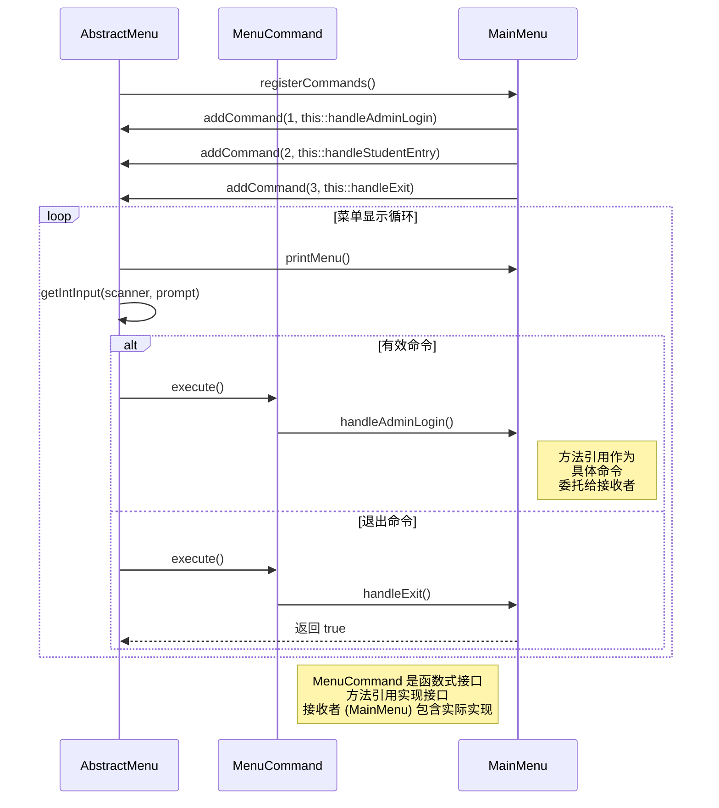

# 命令模式 时序图

## 时序图

## 命令模式使用的关键步骤

1. **命令注册**: 在菜单初始化期间，具体菜单通过将菜单选项与方法引用关联来注册命令。
2. **用户选择**: 当用户选择菜单选项时，AbstractMenu 检索相应命令。
3. **命令执行**: AbstractMenu 调用命令的 `execute()` 方法。
4. **方法调用**: 方法引用在接收者 (MainMenu) 中调用适当的方法。

## 展示的优势

- **解耦**: AbstractMenu 不需要知道正在执行的具体方法。
- **灵活性**: 可以通过简单地注册新方法引用来添加新命令。
- **参数化**: 菜单选项使用不同的命令实现进行参数化。
- **可扩展性**: 可以添加额外的菜单选项而无需修改 AbstractMenu 类。