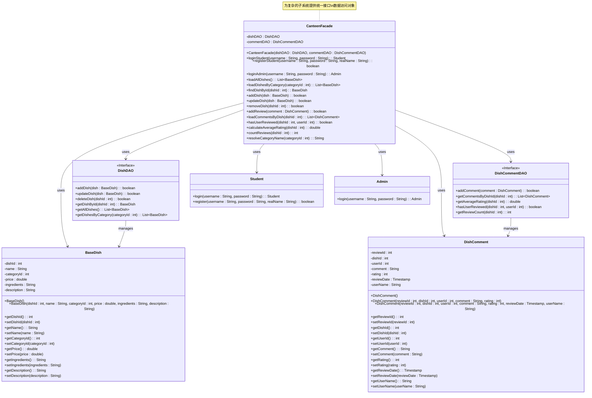

# 外观模式 UML 类图

## 类图

## 主要特点

1. **外观 (CanteenFacade)**: 知道哪些子系统类负责什么，并将客户端请求委托给适当的子系统对象。

2. **子系统类 (DishDAO, DishCommentDAO, BaseDish, DishComment, Student, Admin)**: 实现子系统功能并处理外观对象分配的工作。它们不知道外观的存在，也不保存对外观的引用。

## 参与者

- **外观 (CanteenFacade)**: 知道哪些子系统类负责什么，并将客户端请求委托给适当的子系统对象。
- **子系统类 (DishDAO, DishCommentDAO, BaseDish, DishComment, Student, Admin)**: 实现子系统功能并处理外观对象分配的工作。

## 协作关系

- 客户端通过外观实例与子系统进行通信。
- 外观将客户端请求转发给适当的子系统对象。
- 子系统类不知道外观的存在，也不保存对外观的引用。