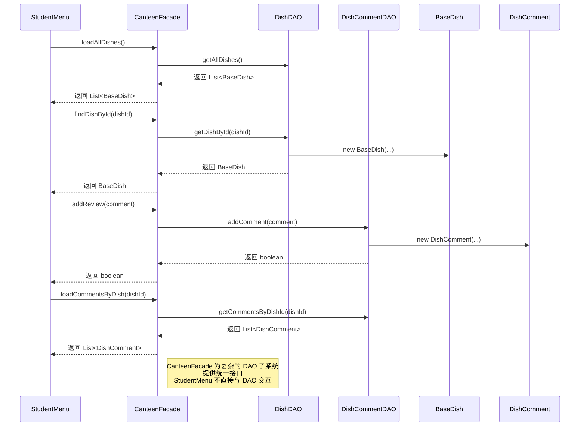

# 外观模式 时序图

## 时序图

## 外观使用的關鍵步骤

1. **客户端请求**: StudentMenu 通过 CanteenFacade 请求操作。
2. **外观委派**: CanteenFacade 将请求委派给适当的子系统组件 (DAO)。
3. **子系统处理**: DAO 执行实际的数据操作。
4. **结果返回**: 结果通过外观传递回客户端。

## 展示的优势

- **简化接口**: StudentMenu 与单个接口交互，而不是多个 DAO。
- **解耦**: StudentMenu 与子系统实现细节解耦。
- **易用性**: 通过外观方法简化复杂操作。