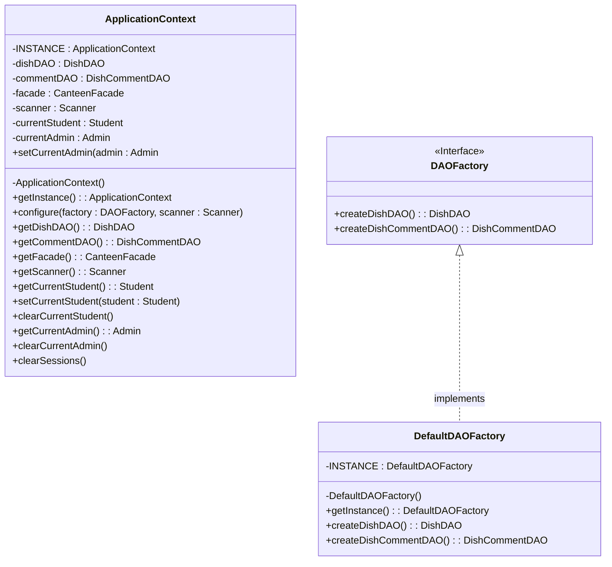

# 单例模式 UML 类图

## 类图

## 主要特点

1. **私有构造函数**: `ApplicationContext` 和 `DefaultDAOFactory` 都具有私有构造函数，以防止外部实例化。

2. **静态实例**: 每个类都有一个私有的静态最终实例成员，用于保存单个实例。

3. **公共访问方法**: 两个类都提供静态的 `getInstance()` 方法来访问单例实例。

4. **线程安全**: 使用饿汉式初始化（类加载时实例化），天生线程安全。

## 参与者

- **单例 (ApplicationContext, DefaultDAOFactory)**: 定义一个 Instance 操作，让客户端能够访问其唯一实例。可能负责创建自己的唯一实例。

## 协作关系

- `ApplicationContext` 与 `DAOFactory` 协作，用于初始化 DAO 对象和 `CanteenFacade`。
- `DefaultDAOFactory` 实现 `DAOFactory` 接口来创建具体的 DAO 实例。
