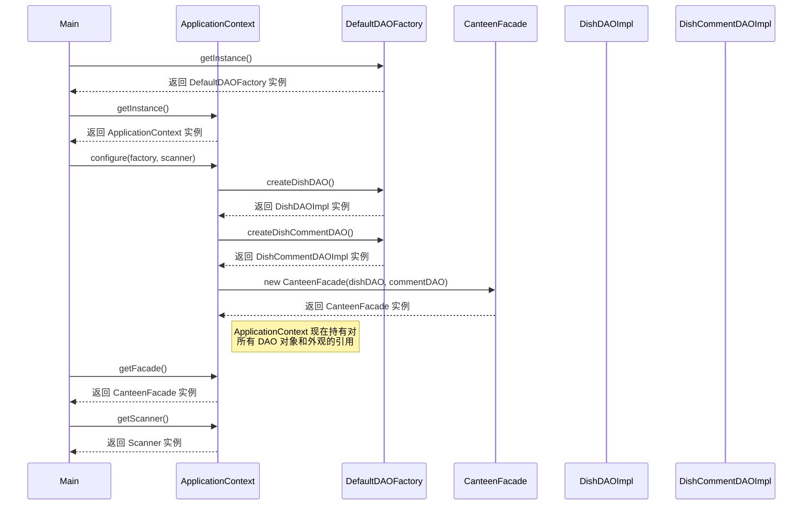

# 单例模式 时序图

## 时序图

## 单例使用的关键步骤

1. **获取工厂实例**: Main 类使用 `getInstance()` 请求 DefaultDAOFactory 的单例实例。
2. **获取上下文实例**: Main 类使用 `getInstance()` 请求 ApplicationContext 的单例实例。
3. **配置**: Main 类使用工厂和扫描器配置 ApplicationContext。
4. **DAO 创建**: ApplicationContext 使用工厂创建具体的 DAO 实例。
5. **外观创建**: ApplicationContext 使用 DAO 实例创建 CanteenFacade。
6. **访问组件**: 其他类可以通过单例 ApplicationContext 访问共享组件。

## 展示的优势

- **全局访问**: 应用程序的任何部分都可以访问单例实例。
- **受控实例化**: 每个单例类只存在一个实例。
- **资源共享**: ApplicationContext 作为共享资源的中央存储库。