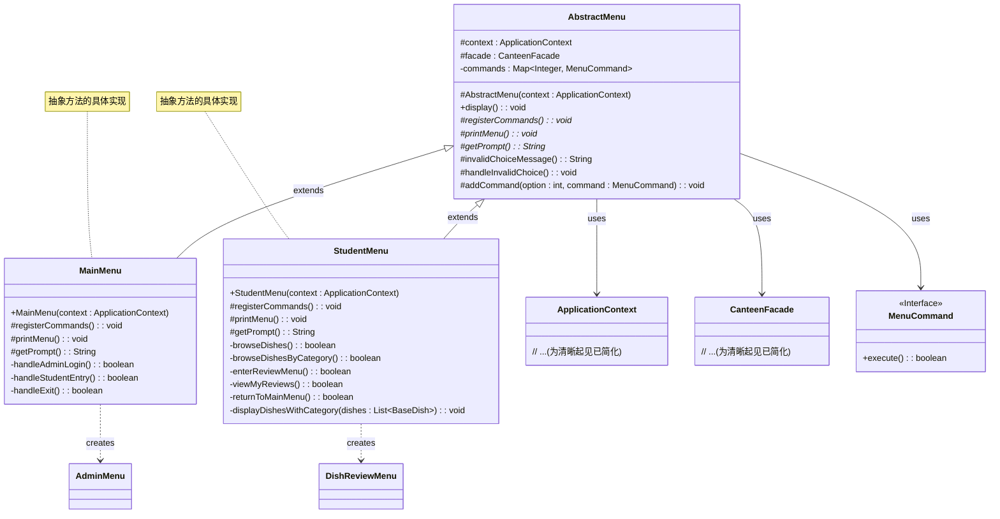

# 模板方法模式 UML 类图

## 类图

## 主要特点

1. **抽象类 (AbstractMenu)**: 定义抽象原语操作（`registerCommands()`, `printMenu()`, `getPrompt()`），具体子类实现这些操作来定义算法的步骤。实现一个模板方法（`display()`），该方法定义算法的骨架。

2. **具体类 (MainMenu, StudentMenu)**: 每个类都实现抽象类的所有抽象操作，以执行算法的子类特定步骤。

## 参与者

- **抽象类 (AbstractMenu)**: 定义抽象原语操作，具体子类定义这些操作来实现算法的步骤，并实现定义算法骨架的模板方法。
- **具体类 (MainMenu, StudentMenu)**: 实现抽象原语操作，以执行算法的子类特定步骤。

## 模板方法

`AbstractMenu` 中的 `display()` 方法是模板方法，它定义了菜单处理的基本结构：
1. 打印菜单选项（`printMenu()`）
2. 获取用户输入（`getPrompt()`）
3. 根据输入执行命令
4. 处理无效选择（`handleInvalidChoice()`）

模板方法本身不会被子类重写，但它调用会被重写的抽象方法。

## 钩子方法

- `invalidChoiceMessage()`: 提供默认实现但可根据需要被子类重写的钩子方法。
- `handleInvalidChoice()`: 另一个提供处理无效用户输入默认行为的钩子方法。

## 协作关系

- 具体类实现模板方法调用的抽象操作，以定义其用例的算法特定步骤。
- 模板方法控制何时调用抽象操作和钩子方法。