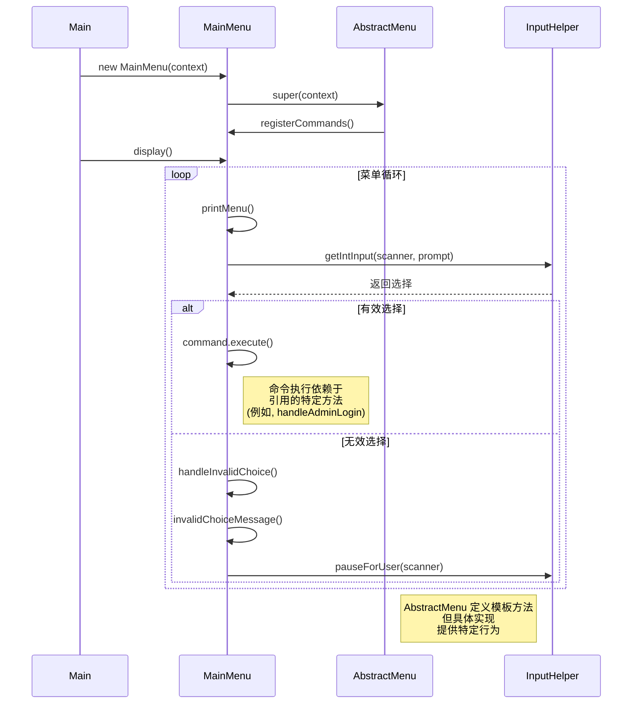

# 模板方法模式 时序图

## 时序图

## 模板方法使用的关键步骤

1. **实例化**: Main 创建具体菜单实例 (MainMenu)。
2. **初始化**: 在构造过程中，抽象菜单的构造函数调用具体类的 `registerCommands()` 方法。
3. **显示循环**: `display()` 模板方法运行一个循环，该循环：
   - 调用具体类的 `printMenu()` 方法
   - 使用 InputHelper 获取用户输入
   - 执行适当命令或处理无效输入
4. **命令执行**: 当执行有效命令时，它运行具体类中引用的特定方法。

## 展示的优势

- **代码重用**: 菜单显示逻辑在抽象类中定义一次。
- **可扩展性**: 通过扩展 AbstractMenu 并实现抽象方法可以创建新菜单类型。
- **控制反转**: 抽象类控制整体流程，在适当的时候调用具体类中的方法。